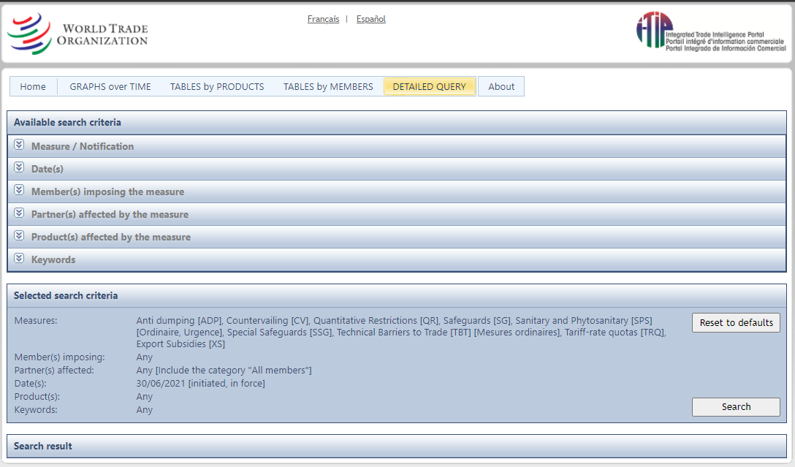

Scraper_wto.org
===
>Need: Database of non-tariff measures  

>Official website: [World trade Organization](https://www.wto.org)  

>Sub page to work: [(NTMs)](https://i-tip.wto.org/goods/Forms/TableView.aspx)  

* dynamic interface

>Imput:

    List | Of | Countries |
     ------------|-----------------|--------------|
     |Alemania | Arabia Saudita,Reino de la | Argentina |
     |Australia | Austria | Bolivia|
     |Brasil| Bulgaria|Bélgica|
     |Canadá| Chile| China
     | Chipre| Colombia     | Corea,República de
     | Costa Rica | Cuba| Dinamarca
     | Ecuador | El Salvador| Eslovenia
     | España| Estados Unidos de América| Estonia|
     | Federación de Rusia| Finlandia| Francia|
     | Grecia| Guatemala| Honduras|
     | Hong Kong| China|Hungría|
     | India| Indonesia| Irlanda| 
     | Islandia| Italia| Japón|
     | Letonia|Malasia| Malta|
     | México| Nicaragua| Noruega|
     | Panamá| Paraguay| Países Bajos|
     | Perú| Polonia | Portugal|
     | Reino Unido| República Checa| República Dominicana|
     | República Eslovaca| Rumania| Suecia| 
     | Suiza| Tailandia| Trinidad y Tabago|
     | Turquía| Uruguay| República Bolivariana de Venezuela|
     | Viet Nam.
